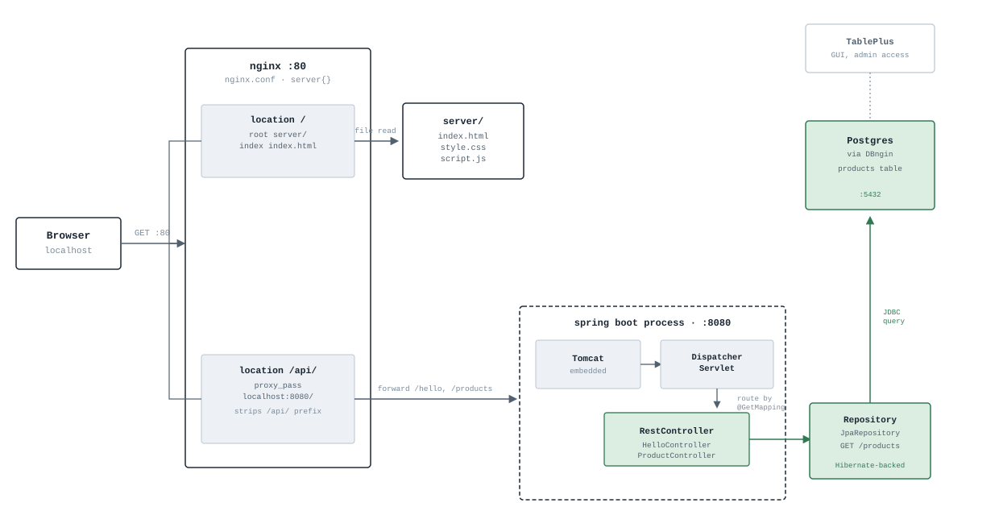

# anatomy-of-a-request

I built and debugged every layer of this myself — no tutorial copy-pasted
start to finish. It traces what actually happens between typing a URL and
seeing data on screen, one hop at a time, through a real local stack:
**Nginx** (static files + reverse proxy) → **Spring Boot** (embedded Tomcat,
REST controllers) → **Hibernate/JPA** → **Postgres**.

The HTML/CSS/JS, the Nginx config, the Spring Boot controllers, the JPA
entity, the database table — all written and debugged by hand, one error at
a time. The full narrative of what broke, why, and what it revealed about
how the stack fits together is in [`docs/LEARNING.md`](docs/LEARNING.md).

## The request's path



Four roles, same shape you'd find in most web architectures:

- **Client** (browser) sends the request.
- **Web server** (Nginx) decides, by path, whether to answer immediately from disk or hand the request off — `/` serves static files directly, `/api/` forwards to the app.
- **Application server** (Spring Boot, on an embedded Tomcat) runs the actual business logic — figures out what data is needed and turns database rows into JSON.
- **Database** (Postgres) stores the data and returns the rows the app asked for.

The response retraces the same path back out — Postgres → app server → web server → client — arriving as JSON.

## Tech stack

| Layer | Tech |
|---|---|
| Reverse proxy / static files |  |
| Language |  |
| Application framework |  |
| Embedded app server |  |
| ORM |  |
| Database |  |
| Build tool |  |
| DB tooling | [DBngin](https://dbngin.com/) (instance manager) · [TablePlus](https://tableplus.com/) (GUI client) |

## What's in here

```
.
├── server/                     static site: index.html, style.css, script.js
├── backend-app/backend-app/    Spring Boot project (Maven)
├── nginx/nginx.conf.snippet    the Nginx server block used, with notes on the
│                                proxy_pass trailing-slash mechanics
└── docs/
    ├── LEARNING.md              the full step-by-step journal
    └── request-path-map.svg     the diagram above
```

## Running it locally

**Prerequisites:** a JDK (21+), [Nginx](https://nginx.org/en/download.html),
and a local Postgres instance — [DBngin](https://dbngin.com/) is the easiest
way to get one running, with [TablePlus](https://tableplus.com/) as a GUI to
inspect it.

1. **Database** — start a Postgres instance via DBngin (default port
   `5432`). Using TablePlus (or `psql`), create the table this project reads
   from:
   ```sql
   CREATE TABLE products (
       id SERIAL PRIMARY KEY,
       name TEXT,
       price NUMERIC
   );
   INSERT INTO products (name, price) VALUES ('Notebook', 5.99), ('Pen', 1.50);
   ```
   Update `backend-app/backend-app/src/main/resources/application.properties`
   if your username/password differ from the defaults there.

2. **Spring Boot app** — from `backend-app/backend-app`:
   ```bash
   ./mvnw spring-boot:run
   ```
   Confirm directly first: `http://localhost:8080/hello` and
   `http://localhost:8080/products`.

3. **Nginx** — copy the block from [`nginx/nginx.conf.snippet`](nginx/nginx.conf.snippet)
   into your `nginx.conf`'s `http { }` section, pointing `root` at this
   repo's `server/` folder, then:
   ```bash
   nginx -s reload
   ```
   (or just start Nginx fresh if it wasn't already running).

4. **Verify the full path**: `http://localhost/` (static site),
   `http://localhost/api/hello`, and `http://localhost/api/products` should
   all resolve — the last one returning live JSON pulled straight from
   Postgres, having passed through every layer above.
